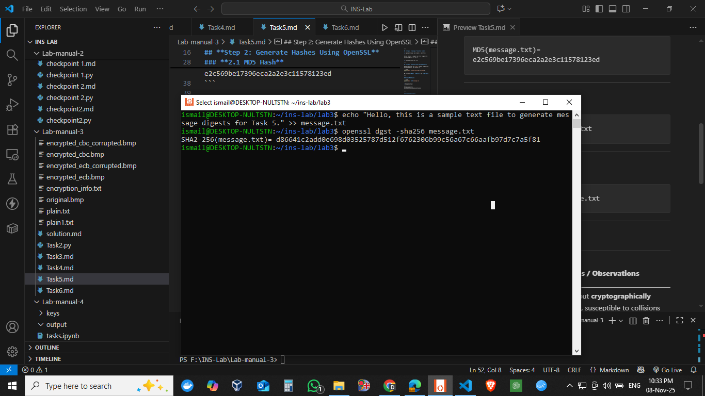

---

## **Step 1: Creating a Plaintext File**

1. Open a terminal and create a text file:

```
Hello, this is a sample text file to generate message digests for Task 5.
```

3. Save and close the file.

---

## **Step 2: Generate Hashes Using OpenSSL**

OpenSSL provides the `dgst` command to generate message digests. The syntax is:

```bash
openssl dgst -<hash_algorithm> <filename>
```

We will try **MD5**, **SHA-1**, and **SHA-256**.

---

### **2.1 MD5 Hash**

```bash
openssl dgst -md5 message.txt
```

* Example output:

```
MD5(message.txt)= e2c569be17396eca2a2e3c11578123ed
```

---

### **2.2 SHA-1 Hash**

```bash
openssl dgst -sha1 message.txt
```

---

### **2.3 SHA-256 Hash**

```bash
openssl dgst -sha256 message.txt
```


---

## **Step 3: Observations**

| **Hash Algorithm** | **Hash Length**     | **Notes / Observations**                                              |
| ------------------ | ------------------- | --------------------------------------------------------------------- |
| MD5                | 128 bits (16 bytes) | Fast but **cryptographically weak**, susceptible to collisions        |
| SHA-1              | 160 bits (20 bytes) | More secure than MD5, but now considered weak for high-security needs |
| SHA-256            | 256 bits (32 bytes) | Strong hash, widely used for digital signatures and certificates      |

**General Observations:**

1. **Deterministic:** Same input always produces the same hash.
2. **One-way:** Cannot easily recover original text from hash.
3. **Small changes:** Even a single character change produces a completely different hash (avalanche effect).

---

##  Step 4: Commands Used 

```bash
openssl dgst -md5 message.txt
openssl dgst -sha1 message.txt
openssl dgst -sha256 message.txt
```

---


