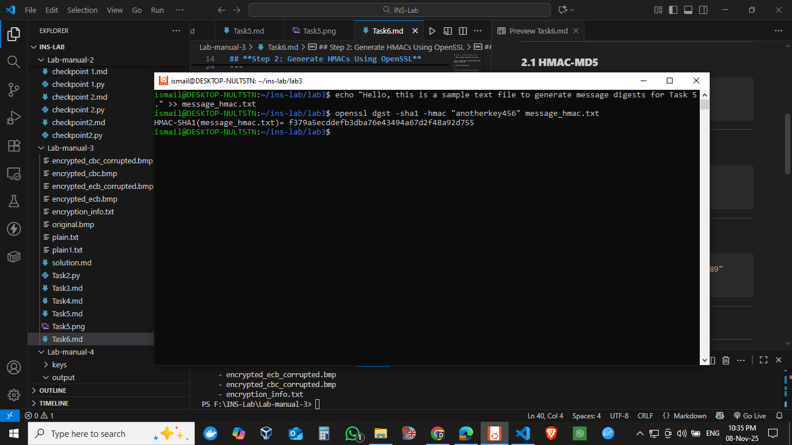

## **Step 1: Creating a Plaintext File**

1. Open a terminal and create a text file:

```
This is a sample text to generate HMACs using different algorithms.
```

2. Save and close the file.

---

## **Step 2: Generate HMACs Using OpenSSL**

OpenSSL supports keyed hashes using the `-hmac` option. The syntax is:

```bash
openssl dgst -<hash_algorithm> -hmac <key> <filename>
```

We will try **HMAC-MD5**, **HMAC-SHA1**, and **HMAC-SHA256** using different keys.

---

### **2.1 HMAC-MD5**

```bash
openssl dgst -md5 -hmac "secretkey123" message_hmac.txt
```

---

### **2.2 HMAC-SHA1**

```bash
openssl dgst -sha1 -hmac "anotherkey456" message_hmac.txt
```

---

### **2.3 HMAC-SHA256**

```bash
openssl dgst -sha256 -hmac "mysecretkey789" message_hmac.txt
```

---

## **Step 3: Observations**

| **Algorithm** | **Key**        | **HMAC Output Length** | **Notes**                                                     |
| ------------- | -------------- | ---------------------- | ------------------------------------------------------------- |
| HMAC-MD5      | secretkey123   | 128 bits (16 bytes)    | Short key works fine, produces fixed-size output              |
| HMAC-SHA1     | anotherkey456  | 160 bits (20 bytes)    | Key can vary in length, output size depends on hash algorithm |
| HMAC-SHA256   | mysecretkey789 | 256 bits (32 bytes)    | Strong, widely used HMAC                                      |

**Key Observations:**

1. HMAC ensures **integrity and authentication** using a secret key.
2. Output length is determined by the hash algorithm, **not key length**.
3. HMAC can safely handle keys of **arbitrary length**:

   * If key > block size of hash (e.g., 64 bytes for SHA-256), key is **hashed first**.
   * If key < block size, it is **padded with zeros** internally.

---

## **Step 4: Commands Used**

```bash
openssl dgst -md5 -hmac "secretkey123" message_hmac.txt
openssl dgst -sha1 -hmac "anotherkey456" message_hmac.txt
openssl dgst -sha256 -hmac "mysecretkey789" message_hmac.txt
```


